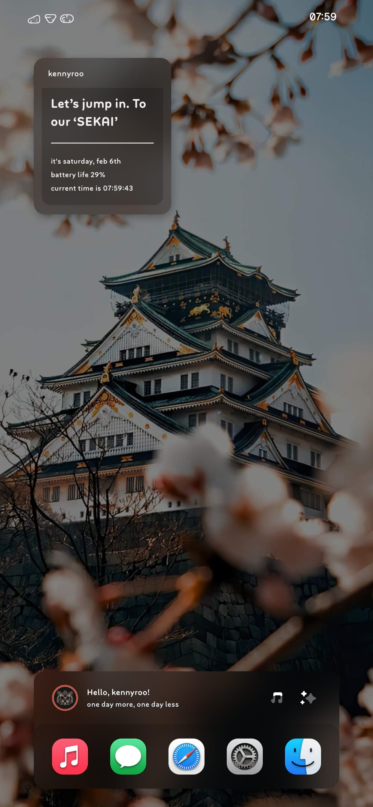
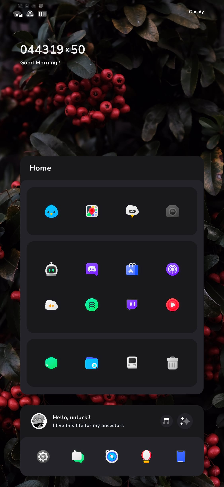
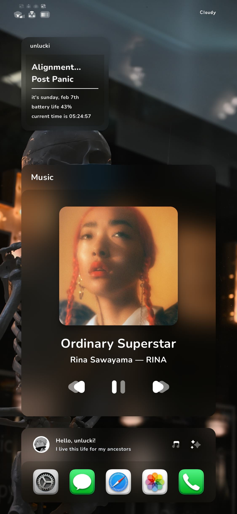

# HS Cocoa

An enhanced iOS rendition of mocacocoa's KLWP.

  

### Prerequesites

> A jailbroken device
>
> Xen HTML v.2.0~release

### Install

This widget can be installed from [alo.works](https://alo.works).

### Setup

To have an optimal experience using this widget, here are some steps you should take:

  1. **Hide the dock.** There are multiple tweaks that can achieve this. I currently use Orion

  2. Move all apps on the **first page** of the homescreen to a different page.

  3. Set widget in **Foreground Mode** on **first page**.

### Options

You can configure the following options:

- Theme (Original or Frosty)
- Custom Text
- Border radius
- Blur intensity
- Badge color, width, & height
- Hide/Only show specific elements
- Enable system font
- Allow Home Container to persist after app launch
- Battery Saver Mode
- Reset (for troubleshooting)

### Note

This package doesn't contain any themes or other modifications shown in the screenshots.
